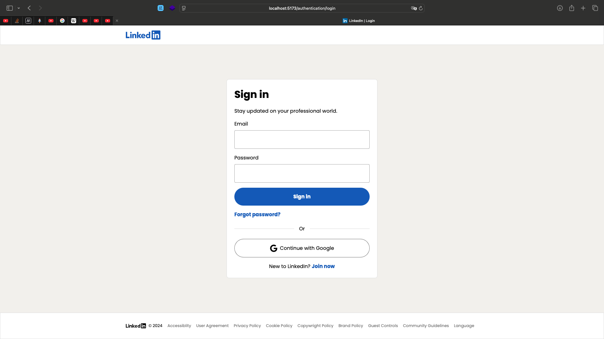

# LinkedIn Clone Project

A full-stack LinkedIn clone built with Spring Boot (Java) backend and React (TypeScript) frontend.



## 🚀 Features

### Backend Features
- **User Authentication**: Registration, login, email verification with JWT tokens
- **Email Service**: Gmail SMTP integration for verification emails
- **Feed System**: Create, read, update, delete posts and comments
- **Messaging**: Real-time messaging between users with WebSocket support
- **Networking**: Send/accept connection requests, manage connections
- **Search**: Apache Lucene-powered full-text search
- **File Upload**: Profile pictures and post attachments
- **Notifications**: Real-time notifications system

### Frontend Features
- **Modern UI**: Responsive design with SCSS modules
- **Authentication Flow**: Login, signup, email verification pages
- **Feed Interface**: Post creation, commenting, liking
- **Messaging Interface**: Real-time chat conversations
- **Profile Management**: Edit profile, upload pictures
- **Network Management**: Connections, invitations, search users
- **Notifications**: Real-time notification display

## 🛠 Tech Stack

### Backend
- **Framework**: Spring Boot 3.3.4
- **Language**: Java 21
- **Database**: H2 (development), JPA/Hibernate
- **Security**: Spring Security, JWT
- **Search**: Apache Lucene
- **Email**: Spring Mail + Gmail SMTP
- **WebSocket**: STOMP protocol
- **Build Tool**: Gradle

### Frontend
- **Framework**: React 18
- **Language**: TypeScript
- **Build Tool**: Vite 6.3.5
- **Styling**: SCSS Modules
- **HTTP Client**: Fetch API
- **WebSocket**: Native WebSocket API

## 📋 Prerequisites

Node.js (version 22 or compatible), npm (version 10 or compatible),
Java JDK (version 21), and Docker (version 24.0.7 or compatible).

#### Backend Setup

Navigate to the backend directory:

```
cd backend
```

Run the docker containers:

```
docker-compose up
```

Set up continuous build:

_Mac/Linux:_

```
./gradlew build -t -x test
```

_Windows:_

```
gradlew.bat build -t -x test
```

Configure environment variables for OAuth 2.0 and OIDC, aka the Continue with Google button. Give fake values if you do not want to test this feature:

_Mac/Linux:_

```
export OAUTH_GOOGLE_CLIENT_ID=your_google_client_id
export OAUTH_GOOGLE_CLIENT_SECRET=your_google_client_secret
```

_Windows:_

```
set OAUTH_GOOGLE_CLIENT_ID=your_google_client_id
set OAUTH_GOOGLE_CLIENT_SECRET=your_google_client_secret
```

Run the backend:

_Mac/Linux:_

```
./gradlew bootRun
```

_Windows:_

```
gradlew.bat bootRun
```

#### Frontend Setup

Navigate to the frontend directory:

```
cd frontend
```

Set up the necessary environment variables:

_Mac/Linux:_

```
cp .env.example .env
```

_Windows:_

```
copy .env.example .env
```

⚠️: make sure all variables are populated. Give fake value for `VITE_GOOGLE_OAUTH_CLIENT_ID` if you do not want to test Oauth 2.0 and OIDC.

Install dependencies:

```
npm install
```

Run the frontend in development mode:

```
npm run dev
```

You can access the backend at `http://localhost:8080`, the frontend at `http://localhost:5173`, and the Mailhog SMTP server UI at `http://localhost:8025`.

The database hostname is `127.0.0.1`, the port is `3306`, and the root password is `root`.
